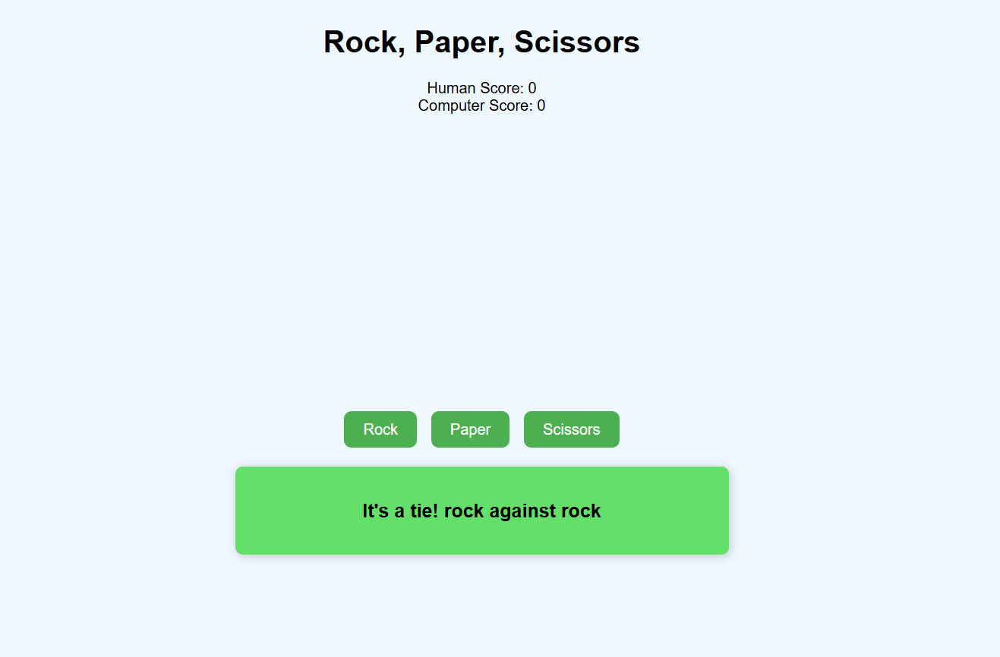

# 🪨 Rock, Paper, Scissors Game

A simple and interactive Rock, Paper, Scissors game built with vanilla JavaScript. The player competes against the computer, and the first to reach 5 points wins the game.

## 🎮 Gameplay

- Click on Rock, Paper, or Scissors to make your move.
- The computer chooses its move randomly.
- The result of each round is displayed immediately.
- The game ends when either the player or the computer reaches 5 points.
- The winner is shown with a short delay to improve user experience.

---

## ✨ Features

- Score tracking for both player and computer
- Clean and simple UI
- Game-over detection using a `gameOver` flag to prevent unwanted multiple clicks
- End-of-game delay using `setTimeout` to show the final result before resetting the UI
- Modular code with separate functions for round handling, score update, and endgame logic

---

## 🧠 Technologies Used

- HTML5
- CSS3
- JavaScript (Vanilla)

---

## 🚀 How to Run

1. Clone the repository:
git clone https://github.com/matheusmarqs1/rock-paper-scissors.git

2. Open the `index.html` file in your browser.

> No dependencies or installations required — it's 100% front-end!

---

## 📸 Preview

---

## 📌 Future Improvements

- Add a "Play Again" button
- Add animations for choices
- Improve UI with better styles
---

## 🧑‍💻 Author

- Matheus Teles  
- GitHub: [@matheusmarqs1](https://github.com/matheusmarqs1)

